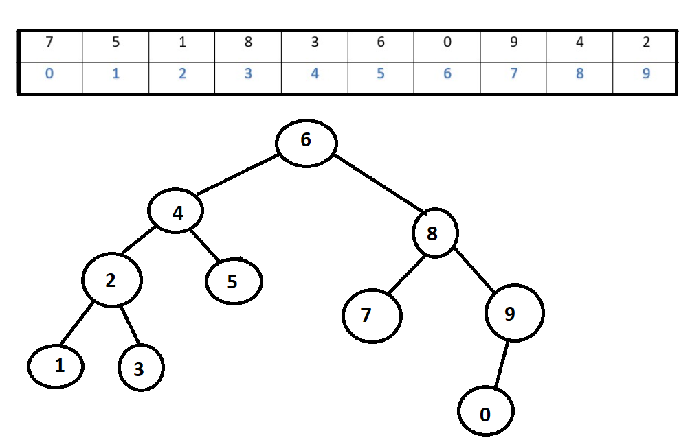

#  Veri Yapıları ve Algoritma Bitirme Projeleri
   

# [22,27,16,2,18,6] dizisinin Insertion Short türüne göre aşamaları ;
  
-------------------
>*  [16,22,27,2,18,6]
>* [2,16,22,27,18,6]
>* [2,16,18,22,27,6]
>* [2,6,16,18,22,27]

--------------------
 

### Big-O gösterimi ;
 

>O(n^2) / (n kare)
-----------
 

## Dizi sıralandıktan sonra 18 sayısı hangi case kapsamına girer ?

  

>Average case

  

## [7,3,5,8,2,9,4,15,6] dizisinin Insertion Sort'a göre ilk 4 adımı ;
--------------------
 

>* [3,7,5,8,2,9,4,15,6]
>* [3,5,7,8,2,9,4,15,6]
>* [2,3,5,7,8,9,4,15,6]
>* [2,3,4,5,7,8,9,15,6]

  

------------
#  [16,21,11,8,12,22] dizisinin Merge Sort aşamaları ; 

  

>* [16,21,11] ------------[8,12,22]
>* [16]-[21,11]  ---------[8]-[12,22]
>* [16]-[21]-[11]--------[8]-[12]-[22]
>* [16]-[11,21]----------[8]-[12,22]
>* [11,16,21]------------[8,12,22]
>* -------[8,11,12,16,21,22]---------

  

### Big-O gösterimi ;

 

>O(nlogn)

    

## [7, 5, 1, 8, 3, 6, 0, 9, 4, 2]  dizisinin Binary-Search-Tree aşamaları ;

   

